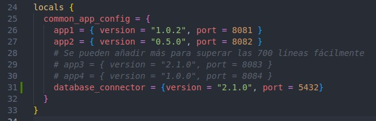
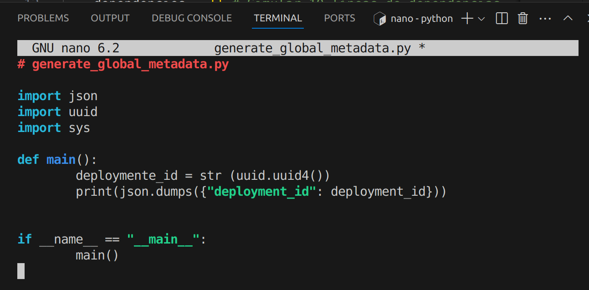
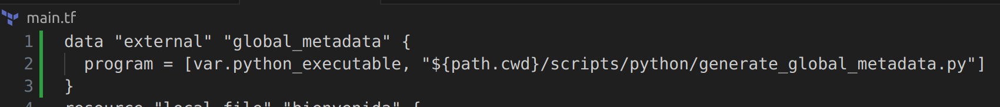
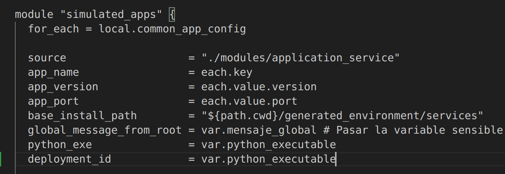
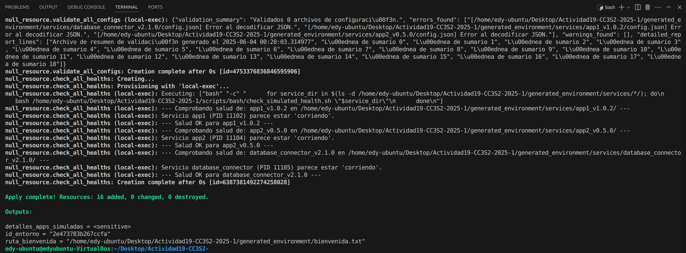
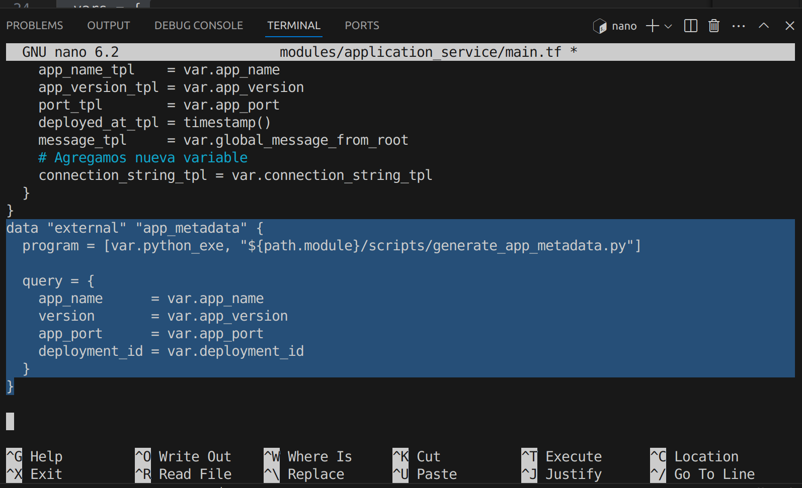
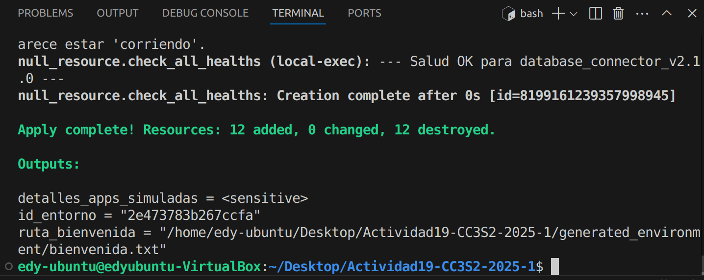
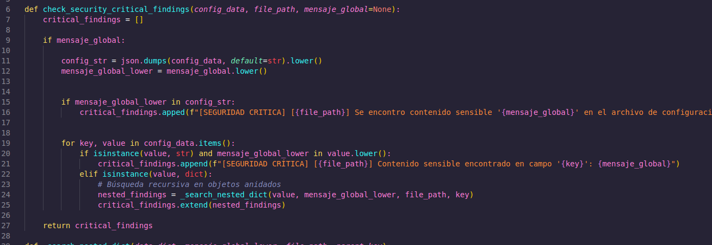

# Actividad 19: Orquestador local de entornos de desarrollo simulados con Terraform

### Integrantes:

- Frank Oliver Hinojosa Zamora
- Germain Ronald Choquechambi Quispe
- Guido Anthony Chipana Calderon
- Edy Saul Serrano Arostegui

Demostraremos los conceptos y principios fundamentales de IaC utilizando Terraform para gestionar un entorno de desarrollo simulado completamente local. Aprenderemos a definir, aprovisionar y modificar "infraestructura" (archivos, directorios, scripts de configuración) de forma reproducible y automatizada.

**Prerrequisitos:**

- Terraform instalado localmente.
- Python 3 instalado localmente.
- Conocimientos básicos de la línea de comandos (Bash).
- Un editor de texto o IDE.

**Estructura del proyecto (Archivos y directorios)**

Puedes revisar las instrucciones adicionales y el código completo y sus modificaciones dependiendo de tu sistema operativo en [proyecto inicial de IaC](https://github.com/kapumota/DS/tree/main/2025-1/Proyecto_iac_local).

```bash
proyecto_iac_local/
├── main.tf                     # Configuración principal de Terraform
├── variables.tf                # Variables de entrada
├── outputs.tf                  # Salidas del proyecto
├── versions.tf                 # Versiones de Terraform y providers (local, random)
├── terraform.tfvars.example    # Ejemplo de archivo de variables
│
├── modules/
│   ├── application_service/    # Módulo para simular un "servicio"
│   │   ├── main.tf
│   │   ├── variables.tf
│   │   ├── outputs.tf
│   │   └── templates/
│   │       └── config.json.tpl # Plantilla de configuración del servicio
│   │
│   └── environment_setup/      # Módulo para la configuración base del entorno
│       ├── main.tf
│       ├── variables.tf
│       └── scripts/
│           └── initial_setup.sh # Script de Bash para tareas iniciales
│
├── scripts/                    # Scripts globales
│   ├── python/
│   │   ├── generate_app_metadata.py # Genera metadatos complejos para apps
│   │   ├── validate_config.py       # Valida archivos de configuración generados
│   │   └── report_status.py         # Genera un reporte del "estado" del entorno
│   └── bash/
│       ├── start_simulated_service.sh # Simula el "arranque" de un servicio
│       └── check_simulated_health.sh  # Simula una "comprobación de salud"
│
└── generated_environment/      # Directorio creado por Terraform
    └── (aquí se crearán archivos y directorios)
```

## **Ejercicios**

1. **Ejercicio de evolvabilidad y resolución de problemas:**
    - **Tarea:** Añade un nuevo "servicio" llamado `database_connector` al `local.common_app_config` en `main.tf`. Este servicio requiere un parámetro adicional en su configuración JSON llamado `connection_string`.
    - **Pasos:**
        1. Modifica `main.tf` para incluir `database_connector`.
        
        
        
        Hemos agregado `database_connector` en `locals` del `main.tf` raiz 
        
        1. Modifica el módulo `application_service`:
            - Añade una nueva variable `connection_string_tpl` (opcional, por defecto un string vacío)
            
            
            
            - Actualiza `config.json.tpl` para incluir este nuevo campo.
            
            
            
            - Haz que el `connection_string` solo se incluya si la variable no está vacía (usar condicionales en la plantilla o en `locals` del módulo).
            - Agregamos la nueva variable a `data "template_file" "app_config"` del `main.tf` del modulo `application_service`
            
            
            
            - Agregamos la nueva variable a `module "simulated_apps"` del `main.tf` raiz
        
        
        
        1. Actualiza el script `validate_config.py` para que verifique la presencia y formato básico de `connection_string` SOLO para el servicio `database_connector`.
    
    
    
    - **Reto adicional:** Haz que el `start_simulated_service.sh` cree un archivo `.db_lock` si el servicio es `database_connector`.

    

2. **Ejercicio de refactorización y principios:**
    - **Tarea:** Actualmente, el `generate_app_metadata.py` se llama para cada servicio. Imagina que parte de los metadatos es común a *todos* los servicios en un "despliegue" (ej. un `deployment_id` global).
    - **Pasos:**
        1. Crea un nuevo script Python, `generate_global_metadata.py`, que genere este `deployment_id` (puede ser un `random_uuid`).
        
        
        
        1. En el `main.tf` raíz, usa `data "external"` para llamar a este nuevo script UNA SOLA VEZ.
        
        
        
        1. Pasa el `deployment_id` resultante como una variable de entrada al módulo `application_service`.
        
        
        
        
        
        1. Modifica `generate_app_metadata.py` y/o `config.json.tpl` dentro del módulo `application_service` para que incorpore este `deployment_id` global.
        
        
        
        
        
    - **Discusión:** ¿Cómo mejora esto la composabilidad y reduce la redundancia? ¿Cómo afecta la idempotencia?
    
    Centralizar la generación del `deployment_id` mejora la composabilidad al permitir que todos los servicios compartan metadatos globales coherentes sin duplicar y esto reduce la redundancia, ya que se evita generar un identificador único por cada servicio y además fortalece la idempotencia, ya que al generar el `deployment_id` una sola vez, Terraform no recrea recursos innecesariamente en cada ejecución.

3. **Ejercicio de idempotencia y scripts externos:**
    - **Tarea:** El script `initial_setup.sh` crea `placeholder_$(date +%s).txt`, lo que significa que cada vez que se ejecuta (si los `triggers` lo permiten), crea un nuevo archivo.
    - **Pasos:**
        1. Modifica `initial_setup.sh` para que sea más idempotente: antes de crear `placeholder_...txt`, debe verificar si ya existe un archivo `placeholder_control.txt`. Si no existe, lo crea y también crea el `placeholder_...txt`. Si `placeholder_control.txt` ya existe, no hace nada más.
            - **`CONTROL_FILE="placeholder_control.txt"`**: Definimos una variable para el nombre del archivo de control.
            - **`EXECUTION_COUNT_FILE="execution_count.txt"`**: Definimos una variable para el archivo que almacenará el contador.
                
                
                
        2. Ajusta los `triggers` del `null_resource "ejecutar_setup_inicial"` en el módulo `environment_setup` para que el script se ejecute de forma más predecible (quizás solo si una variable específica cambia).
            
            
            
            Modificamos el `null_resource "ejecutar_setup_inicial"` porque queremos que este script se ejecute de forma más predecible. Si el script es idempotente, los `triggers` solo deberían forzar su ejecución si algo *realmente* relevante para su estado cambia.
            
        - **Reto adicional:** Implementa un "contador de ejecución" en un archivo dentro de `generated_environment`, que el script `initial_setup.sh` incremente solo si realmente realiza una acción.
            
            
            
            Implementamos el contador de ejecución dentro de `initial_setup.sh`.
            
            **Lógica en `initial_setup.sh`:**
            
            Dentro del bloque `if [ ! -f "$CONTROL_FILE" ]; then`, se ejecuta solo si es la primera vez que se realizan las acciones idempotentes:
            
            - Verifica si `execution_count.txt` existe. Si no, lo crea con "0".
            - Lee el valor actual, lo incrementa en 1, y lo escribe de vuelta en `execution_count.txt`.
            
            `Terraform apply`
            
            
            
4. **Ejercicio de seguridad simulada y validación:**
    - **Tarea:** El `mensaje_global` se marca como `sensitive` en `variables.tf`. Sin embargo, se escribe directamente en `config.json`.
    - **Pasos:**
        1. Modifica el script `validate_config.py` para que busque explícitamente el contenido de `mensaje_global` (que el estudiante tendrá que "conocer" o pasar como argumento al script de validación) dentro de los archivos `config.json`. Si lo encuentra, debe marcarlo como un "hallazgo de seguridad crítico".
            
            
            